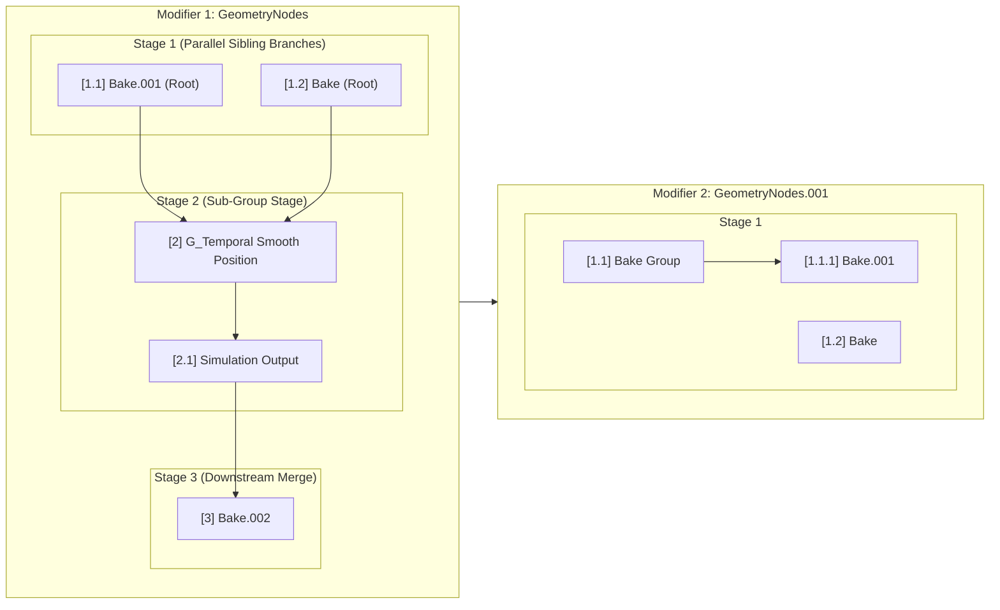

# GN Bake Control — Architecture & Dependency Graphing

## 1. Overview & Core Philosophy

**GN Bake Control** is a deterministic execution sequencing and cache management engine for Blender 5.2+ Geometry Nodes. 

Standard Blender modifier evaluation is top-down at the object level, but internally within each Geometry Node tree, data flows through an arbitrary **Directed Acyclic Graph (DAG)**. Native Blender tools and legacy add-ons evaluate bake items in arbitrary collection order (`mod.bakes`), which can lead to invalid states, corrupt caches, and missing upstream prerequisites during batch operations.

GN Bake Control resolves the node graph into an explicit, topologically sequenced execution pipeline with hierarchical branch indexing (`1.1`, `1.2` $\rightarrow$ `2` $\rightarrow$ `3`).

---

## 2. Graph Traversal & Execution Invariants

### Invariant Guarantees:
1. **Modifier Stack Chronology**: Modifiers evaluate from index `0` to `N-1`. All bakes in Modifier $M$ must complete before Modifier $M+1$ evaluates.
2. **DAG In-Degree Zero & Longest-Path Staging**:
   - Reachability is evaluated backward from all active `GROUP_OUTPUT` nodes along valid data links.
   - Parallel upstream branches with zero mutual dependencies share the same stage index with fractional sibling suffixes (e.g. `1.1`, `1.2`).
   - Sibling branches converging into a downstream join node advance the execution stage to $S+1$ (e.g. `2`).
3. **Recursive Group Encapsulation**:
   - Group nodes (`GROUP`) are traversed recursively in their parent tree's topological slot.
   - Inner bakes append their local stage to the group's parent stage (e.g. Group `2` $\rightarrow$ internal bake `2.1`; Group `1.1` $\rightarrow$ internal bake `1.1.1`).
4. **Simulation Zone Parity**:
   - `SIMULATION_OUTPUT` nodes are treated as first-class bake targets alongside native `BAKE` nodes.
5. **Mute State Inheritance**:
   - Group mute states recursively propagate downward: muting a parent node tree marks all internal bakes as `is_muted = True` and dims them in the UI.
6. **Disconnected / Stale Isolation**:
   - Nodes detached from `GROUP_OUTPUT` are segregated to the bottom of the stack and numbered with values above the last connected stage (e.g. `[4] Bake (Disc)`).

---

## 3. UI Representation & Hierarchical Branch Numbering

The UI reflects the DAG execution stages via clean numeric badges and nested sub-group containers:

- **Modifier Header**: Name, active/disconnected counts, and master `▶` jump button.
- **Stage Number Badges**:
  - `[1.1]`, `[1.2]`: Parallel upstream sibling branches.
  - `[2]`: Downstream stage (or Group container).
  - `[2.1]`: Internal node within stage 2 group.
  - `[3]`: Final merge stage.
  - `[4] [Disc]`: Disconnected/stale bake.
- **Action Controls**:
  - `✔` / `⚪`: Cache status indicator (internal memory data-blocks and on-disk `.blob`/`.bphys` caches).
  - `▶`: Multi-window context-overridden focus button navigating the Geometry Node Editor into nested breadcrumbs and framing the selected node with `bpy.ops.node.view_selected()`.
  - `Bake`: Text button triggering single-node bake.
  - `🗑`: Trash can icon button clearing cache for that node.

---

## 4. Future Roadmap & Multi-Object Extension

While current scope focuses on single-object graph traversal and sequencing, this architecture serves as the foundation for:

1. **Bake Up to Point**:
   - Ability to selectively execute all dependencies upstream of a specific node $K$ without baking downstream nodes.
2. **Cache Invalidation & Dirty Propagation**:
   - Tracking topological timestamps or graph hashes: when node $X$ is modified or rebaked, downstream bakes ($X \rightarrow Y \rightarrow Z$) are flagged as *Dirty / Stale*.
3. **Multi-Object Dependency Graphing (Houdini-Level Overview)**:
   - Constructing an Object-Level DAG via Object Info, Collection Info, and Geometry Proximity dependencies across the entire Blender scene.
   - Outliner/Tree alternative showing cross-object data flows and coordinated scene-wide rebaking.
